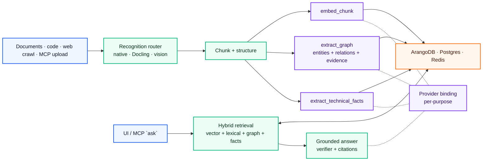

<p align="center">
  
</p>

<h1 align="center">IronRAG</h1>
<p align="center"><b>Self-hosted knowledge memory for AI agents and teams.</b><br/>One docker-compose, your data on your servers, any LLM provider.</p>

<p align="center">
  <a href="https://github.com/mlimarenko/IronRAG/stargazers"></a>
  <a href="https://github.com/mlimarenko/IronRAG/releases"></a>
  <a href="https://hub.docker.com/r/pipingspace/ironrag-backend"></a>
  <a href="./LICENSE"></a>
</p>

<p align="center">
  
</p>

---

## What IronRAG provides

- **Typed knowledge graph.** Documents are decomposed into entities, typed relationships, and chunk-level evidence references. Retrieval combines vector, lexical, graph-traversal, and technical-fact lanes; the answer pipeline returns citations to the underlying chunks.
- **Native MCP server.** 21 tools across documents, graph, web ingest, and grounded `ask`. Connect it to MCP-compatible agents and clients such as Claude Desktop, Claude Code, Cursor, Codex, VS Code with Continue / Cline / Roo, Zed, OpenClaw, Hermes, Lobe-style chat agents, or a custom HTTP MCP client. Tools are scoped per IAM token.
- **Provider-agnostic AI runtime.** Seven LLM providers ship in the catalog — OpenAI, DeepSeek, Qwen (DashScope-intl), GPTunnel, OpenRouter, RouterAI, Ollama. Each pipeline purpose (`extract_text`, `extract_graph`, `embed_chunk`, `query_compile`, `query_retrieve`, `query_answer`, `vision`) is bound independently and can use a different provider.
- **USD cost catalog.** Every binding stores prices in USD. Per-call billing rows are written for every LLM request and rolled up per document and per query in the UI.
- **Multi-tenant IAM.** Principals, scoped tokens (system / workspace / library), and permission groups gate every API surface. Audit log captures resource access.
- **Self-hosted runtime.** Single `docker compose up -d` boots the full stack (PostgreSQL, ArangoDB, Redis, backend, worker, frontend). Helm chart available for Kubernetes.
- **Code-aware ingest.** 15-language tree-sitter AST parsing. Native parsers for JSON / YAML / TOML / CSV / XLSX. Technical-fact extraction for paths, params, endpoints, env vars, and error codes.
- **CPU-first recognition.** Docling CPU runtime is baked into the backend image; PDF / DOCX / PPTX layout extraction, raster-image OCR, and embedded document-picture OCR run without a GPU. Stored PDFs are extracted through resumable page-range checkpoints, and image OCR can be switched per library to an active vision binding.
- **Restart-safe processing.** Long document jobs keep durable extraction units, reusable embedding / graph outputs, and lease-guarded finalization, so stack restarts or transient network breaks resume from the last completed unit instead of discarding hours of work.
- **Durable assistant turns.** UI answer streaming is an activity channel over the same persisted query execution; if the browser or proxy drops the stream after work starts, the frontend reloads the completed session result instead of submitting the question again. LLM debug snapshots are stored per execution for post-reload inspection.
- **Backup and restore.** Streaming `tar.zst` archive with selective sections (catalog only, with blobs, with graph). Restore to the same or a different deployment.

## Quick start

```bash
# One line, Docker required
curl -fsSL https://raw.githubusercontent.com/mlimarenko/IronRAG/master/install.sh | bash
```

Or from source:

```bash
git clone https://github.com/mlimarenko/IronRAG.git
cd IronRAG
cp .env.example .env             # add IRONRAG_OPENAI_API_KEY=sk-...
docker compose up -d
```

Open [http://127.0.0.1:19000](http://127.0.0.1:19000), create an admin account, upload a document, ask a question. That's it.

## Multi-provider in one line

Set as many provider keys as you need in `.env` — credentials auto-register on the next restart, and every model preset becomes available in the admin UI.

```env
IRONRAG_OPENAI_API_KEY=sk-...
IRONRAG_DEEPSEEK_API_KEY=...
IRONRAG_QWEN_API_KEY=sk-...
IRONRAG_GPTUNNEL_API_KEY=...
IRONRAG_OPENROUTER_API_KEY=sk-or-v1-...
IRONRAG_ROUTERAI_API_KEY=...
```


| Provider                  | Chat | Vision | Embedding | Notes                                                                |
| ------------------------- | ---- | ------ | --------- | -------------------------------------------------------------------- |
| **OpenAI**                | ✅    | ✅      | ✅         | Direct API                                                           |
| **DeepSeek**              | ✅    | —      | —         | Very low cost; may be slower than other APIs; no native vision/embeddings |
| **Qwen / DashScope-intl** | ✅    | ✅      | ✅         | Cost is close to DeepSeek; API is often faster; strong chat/vision/embedding lane |
| **GPTunnel**              | ✅    | ✅      | ✅         | Router provider: many upstream model families behind one key         |
| **OpenRouter**            | ✅    | ✅      | —         | Router provider: many upstream model families behind one key         |
| **RouterAI**              | ✅    | ✅      | ✅         | Router provider: many upstream model families behind one key         |
| **Ollama**                | ✅    | ✅      | ✅         | Fully local, air-gapped, GPU optional                                |


Bind any provider to any pipeline purpose under **Admin → AI → Bindings**: `extract_text`, `extract_graph`, `embed_chunk`, `query_compile`, `query_retrieve`, `query_answer`, `vision`. The bindings are scoped to instance, workspace, or library — a workspace can override the instance default for a single purpose.

Optional bindings note: `vision` and `extract_text` are optional. Keep libraries on the Docling raster-image engine by default; switch a library to `vision` only when that library should use an active vision binding for image OCR. Selecting `vision` without a binding fails loudly.

## Common deployments

- **Internal knowledge bot.** A company library is fed from BookStack, Confluence, Google Drive, SharePoint, or a recursive web crawl. Engineering, support, and policy questions are answered through the UI assistant or via MCP, with citations linking back to the original chunks.
- **Public portal / helpdesk assistant.** A self-hosted assistant fronts your published documentation, release notes, and runbooks. The MCP `ask` tool drives a chat widget; queries do not leave the host infrastructure.
- **Engineering / coding agent.** AST-parsed source trees and extracted technical facts (endpoints, env vars, config keys, error codes) give an MCP-connected agent structured context for architecture and "what changed" questions across releases.
- **Personal long-term memory.** A single-tenant deployment used as a long-lived second brain — papers, notes, code snippets, web clippings — queried from any MCP client. The graph grows as the library grows.
- **On-prem / regulated AI.** Bind every purpose to Ollama for an air-gapped runtime. The deployment is inert outside its own network: no provider telemetry, IAM-scoped tokens, full backup archive for retention.

## Star history

<p align="center">
  <a href="https://star-history.com/#mlimarenko/IronRAG&Date">
    <picture>
      <source media="(prefers-color-scheme: dark)" srcset="https://api.star-history.com/svg?repos=mlimarenko/IronRAG&type=Date&theme=dark" />
      <source media="(prefers-color-scheme: light)" srcset="https://api.star-history.com/svg?repos=mlimarenko/IronRAG&type=Date" />
      
    </picture>
  </a>
</p>

---

## Tech stack


| Layer                    | Technology                                                      |
| ------------------------ | --------------------------------------------------------------- |
| Backend                  | Rust 1.95, axum, tokio, SQLx, tower                             |
| Frontend                 | React 19, Vite 8, TypeScript 6, Tailwind 4, shadcn/ui           |
| Frontend build/runtime   | Node 24 (build), Nginx 1.30 (static serving)                    |
| Graph rendering          | Sigma.js + Graphology (WebGL, Web Worker layout)                |
| Knowledge graph store    | ArangoDB 3.12                                                   |
| Document / catalog store | PostgreSQL 18                                                   |
| Cache / job queue        | Redis 8                                                         |
| Document recognition     | Docling CPU runtime, native parsers, tree-sitter (15 languages) |
| MCP                      | model-context-protocol native server, 21 tools                  |
| Deployment               | Docker Compose, Helm chart                                      |


## Pipeline overview




1. **Ingest.** Files, web pages, and API / MCP uploads enter the recognition router (`extract_text`), stored PDFs are checkpointed by page range, source text is split into structured chunks (`chunk_content` + structured-block preparation), and persisted to ArangoDB.
2. **Build memory.** Each chunk is embedded (`embed_chunk`), scanned for technical literals (`extract_technical_facts`), and processed by `extract_graph` to write entities, typed relations, and evidence references.
3. **Query.** A query session compiles the user request into typed IR (`query_compile`); vector, lexical, graph-traversal, and technical-fact lanes retrieve concurrently; the answer router selects between a grounded answer (`query_answer`) and a clarification, runs the verifier, and persists citations to the response.
4. **Provider routing.** Every LLM call resolves through the binding for its purpose. Switching `query_answer` from OpenAI to a local Ollama model is a binding change at the matching scope (instance / workspace / library).

For deep dives:


| Topic                        | English                                          | Russian                                          |
| ---------------------------- | ------------------------------------------------ | ------------------------------------------------ |
| Architecture overview        | [docs/en/README.md](./docs/en/README.md)         | [docs/ru/README.md](./docs/ru/README.md)         |
| Ingestion pipeline           | [docs/en/PIPELINE.md](./docs/en/PIPELINE.md)     | [docs/ru/PIPELINE.md](./docs/ru/PIPELINE.md)     |
| MCP server & tools           | [docs/en/MCP.md](./docs/en/MCP.md)               | [docs/ru/MCP.md](./docs/ru/MCP.md)               |
| IAM & tokens                 | [docs/en/IAM.md](./docs/en/IAM.md)               | [docs/ru/IAM.md](./docs/ru/IAM.md)               |
| CLI reference                | [docs/en/CLI.md](./docs/en/CLI.md)               | [docs/ru/CLI.md](./docs/ru/CLI.md)               |
| Frontend architecture        | [docs/en/FRONTEND.md](./docs/en/FRONTEND.md)     | [docs/ru/FRONTEND.md](./docs/ru/FRONTEND.md)     |
| Webhooks                     | [docs/en/WEBHOOK.md](./docs/en/WEBHOOK.md)       | [docs/ru/WEBHOOK.md](./docs/ru/WEBHOOK.md)       |
| Benchmarks                   | [docs/en/BENCHMARKS.md](./docs/en/BENCHMARKS.md) | [docs/ru/BENCHMARKS.md](./docs/ru/BENCHMARKS.md) |
| Changelog                    | [CHANGELOG.md](./CHANGELOG.md)                   | —                                                |


## Other deployment options

```bash
# With S3-compatible storage (bundled s4core)
docker compose -f docker-compose-s4.yml up -d

# Local source build for development
docker compose -f docker-compose-local.yml up --build -d
```

Helm (Kubernetes):

```bash
helm upgrade --install ironrag charts/ironrag \
  --namespace ironrag --create-namespace \
  --set-string app.providerSecrets.openaiApiKey="${OPENAI_API_KEY}" \
  --wait --timeout 20m
```

## License

[MIT](./LICENSE)
