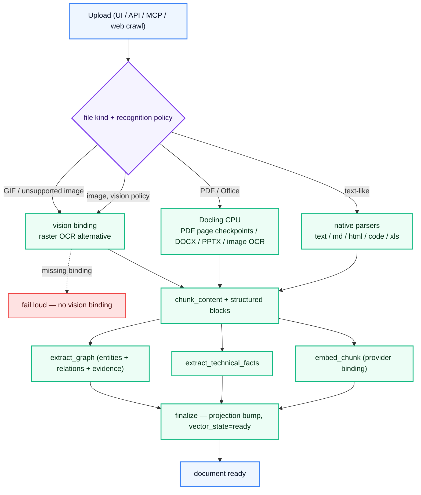
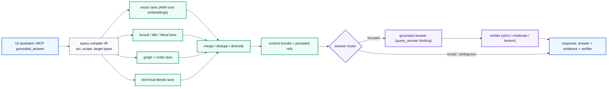

# IronRAG — technical documentation (EN)

Technical reference for IronRAG operators, integrators, and contributors.
The product overview lives in the [top-level README](../../README.md);
this directory is the entry point for deeper technical material.

## Document index

| File | Topic |
|---|---|
| [PIPELINE.md](./PIPELINE.md) | Ingestion pipeline: recognition routing, chunking, structured preparation, embedding, technical-fact and graph extraction, finalize. |
| [MCP.md](./MCP.md) | Model Context Protocol server, 21 tools, token scoping, transport modes. |
| [IAM.md](./IAM.md) | Identity / access model: principals, scopes, permission groups, system / workspace / library tokens. |
| [CLI.md](./CLI.md) | `ironrag-cli` reference for backfills, GC, password reset, and migration helpers. |
| [FRONTEND.md](./FRONTEND.md) | React 19 + Vite app architecture, vertical feature folders, generated SDK, server-state contract. |
| [WEBHOOK.md](./WEBHOOK.md) | Outbound webhook subsystem: events, payload contract, signing, retry policy. |
| [BENCHMARKS.md](./BENCHMARKS.md) | Performance baselines for retrieval, ingest, graph render, MCP-UI parity. |

## Pipeline at a glance

Recognition policy is per-library
(`PUT /v1/catalog/libraries/{libraryId}/recognition-policy` with
`{"rasterImageEngine":"docling"}` or `{"rasterImageEngine":"vision"}`).
New libraries inherit
`IRONRAG_RECOGNITION_DEFAULT_RASTER_IMAGE_ENGINE=docling`. Missing vision
bindings fail loud when the policy selects `vision`; there is no silent
provider fallback.

Stored PDFs are restart-safe: completed Docling page ranges are persisted as
ingest units and reused after worker restarts, backend restarts, lease recovery,
or transient network loss. Chunk embeddings and graph-extraction outputs are
also reused from stable checksums when a job resumes.

Assistant turns are durable as well: UI streaming carries activity for the
same persisted query execution, and a browser or proxy transport drop after
work starts is recovered by reading the completed session result rather than
submitting the prompt again. LLM debug snapshots are stored per execution, so
the provider context remains inspectable after reloads and cached replays.

## Grounded query at a glance

`query_retrieve` and `embed_chunk` bindings are kept in sync — bootstrap
and admin writes reject non-matching vector models before the runtime
can enter a broken retrieval state.

## Storage map

| Store | Role |
|---|---|
| **PostgreSQL** | Catalog (workspaces, libraries, documents, revisions), durable ingest units, AI catalog (providers, models, presets, prices), bindings, IAM, sessions, query executions, billing. Authoritative for everything except the knowledge graph itself. |
| **ArangoDB** | Knowledge graph (nodes, edges, evidence), document store, chunk vectors (3072-dim cosine), structured-block search, technical-fact index. |
| **Redis** | Graph topology cache, IR cache, answer-context cache, prewarm coordination. |
| **Filesystem / S3** | Source-document blobs (configurable; bundled `s4core` provides a built-in S3-compatible blob store). |

## Multi-provider router

Bindings select a `(provider_credential, model_preset)` pair per
pipeline purpose (`extract_text`, `extract_graph`,
`embed_chunk`, `query_compile`, `query_retrieve`, `query_answer`,
`vision`). The catalog ships seven provider profiles — OpenAI,
DeepSeek, Qwen / DashScope-intl, GPTunnel, OpenRouter, RouterAI,
and Ollama — each declared in `ai_provider_catalog` with capability
flags, runtime paths, model-discovery configuration, and a
bootstrap-preset list.

Binding writes enforce two invariants the runtime depends on:

- The model selected for a binding must declare the binding's
  purpose in its `defaultRoles`
  (`ai_catalog_service::catalog::validate_model_binding_purpose`).
- `embed_chunk` and `query_retrieve` must point at the same model
  catalog entry; the vector-counterpart sync upserts the partner
  on every write to keep the active retrieval path consistent.

Per-purpose binding scopes resolve from library → workspace →
instance, so a workspace can override the instance default for a
single purpose without disturbing the rest.

### MCP clients

The MCP server is transport-agnostic. Documented client integrations:
Claude Desktop, Claude Code, Cursor, Codex, VS Code (Continue / Cline /
Roo), Zed, OpenClaw, Hermes, Lobe-style chat agents, and the IronRAG
CLI's local `grounded_answer` invocation. Token scope gates the tool
surface; see [IAM.md](./IAM.md).

See [../../README.md](../../README.md) for the operator-facing
summary and [PIPELINE.md](./PIPELINE.md) for the per-stage purpose
contract.

## License

[MIT](../../LICENSE)
