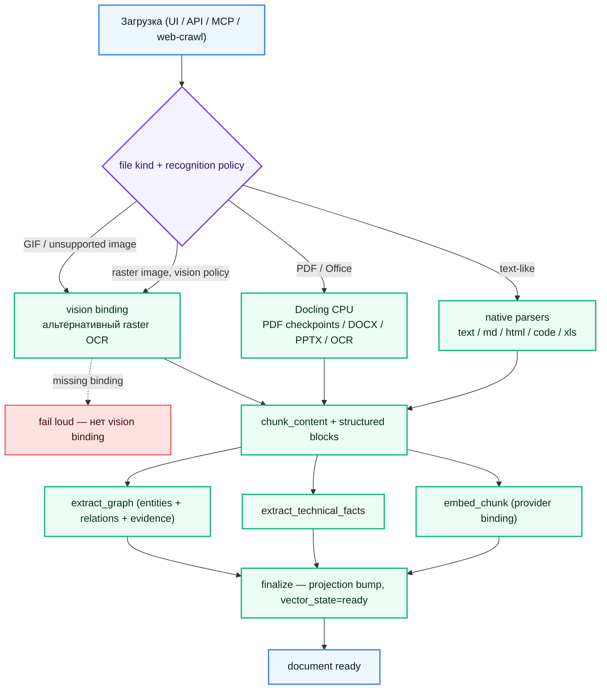
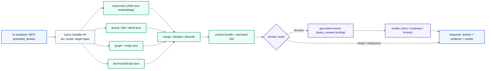

# IronRAG — техническая документация (RU)

Технический справочник для операторов, интеграторов и контрибьюторов
IronRAG. Продуктовый обзор и quick start — в [главном
README](../../README.md); этот каталог — точка входа в более глубокий
технический материал.

## Индекс документов

| Файл | Тема |
|---|---|
| [PIPELINE.md](./PIPELINE.md) | Пайплайн ингеста: маршрутизация распознавания, чанкинг, structured-prep, embedding, технические факты и графовая экстракция, finalize. |
| [MCP.md](./MCP.md) | MCP-сервер, 21 инструмент, scope-токены, режимы транспорта. |
| [IAM.md](./IAM.md) | Модель идентификации/доступа: principals, scope, permission groups, токены system / workspace / library. |
| [CLI.md](./CLI.md) | Справочник `ironrag-cli`: бэкфилы, GC, сброс пароля, миграционные хелперы. |
| [FRONTEND.md](./FRONTEND.md) | Архитектура React 19 + Vite приложения: вертикальные feature-folders, генерируемый SDK, server-state контракт. |
| [WEBHOOK.md](./WEBHOOK.md) | Outbound webhook subsystem: события, контракт payload, подпись, retry-политика. |
| [BENCHMARKS.md](./BENCHMARKS.md) | Performance baseline для retrieve, ingest, рендера графа, MCP-UI parity. |

## Пайплайн в одном кадре

Recognition policy задаётся per-library
(`PUT /v1/catalog/libraries/{libraryId}/recognition-policy` с
`{"rasterImageEngine":"docling"}` или `{"rasterImageEngine":"vision"}`).
Новые библиотеки наследуют
`IRONRAG_RECOGNITION_DEFAULT_RASTER_IMAGE_ENGINE=docling`. Отсутствие
vision binding падает явно, когда policy выбирает `vision`; silent provider
fallback запрещён.

Stored PDFs restart-safe: завершённые Docling page ranges сохраняются как
ingest units и переиспользуются после worker restart, backend restart, lease
recovery или краткого сетевого обрыва. Chunk embeddings и graph-extraction
outputs также переиспользуются по устойчивым checksums при resume job.

Assistant turns тоже durable: UI streaming передаёт activity для того же
persisted query execution, а browser/proxy transport drop после старта работы
восстанавливается чтением завершённого session result без повторной отправки
prompt. LLM debug snapshots сохраняются per execution, поэтому provider context
остаётся доступен после reload и cached replay.

## Grounded-запрос в одном кадре

Bindings `query_retrieve` и `embed_chunk` синхронизированы — bootstrap
и admin-операции отвергают несовпадающие vector-модели до того, как
runtime войдёт в состояние «retrieval сломан».

## Карта хранилищ

| Хранилище | Роль |
|---|---|
| **PostgreSQL** | Catalog (workspaces, libraries, documents, revisions), durable ingest units, AI catalog (providers, models, presets, prices), bindings, IAM, sessions, query executions, billing. Источник правды для всего, кроме самого графа знаний. |
| **ArangoDB** | Knowledge graph (nodes, edges, evidence), document store, chunk vectors (3072-dim cosine), structured-block search, technical-fact индекс. |
| **Redis** | Graph topology cache, IR cache, answer-context cache, координация prewarm. |
| **Filesystem / S3** | Source-document блобы (конфигурируется; включённый `s4core` даёт встроенный S3-совместимый blob-store). |

## Multi-provider router

Binding выбирает пару `(provider_credential, model_preset)` для каждой
purpose-цели пайплайна (`extract_text`, `extract_graph`,
`embed_chunk`, `query_compile`, `query_retrieve`, `query_answer`,
`vision`). Каталог содержит семь профилей провайдеров — OpenAI,
DeepSeek, Qwen / DashScope-intl, GPTunnel, OpenRouter, RouterAI и
Ollama — каждый описан в `ai_provider_catalog` через capability-флаги,
runtime-paths, конфигурацию model-discovery и список bootstrap-пресетов.

Запись binding'ов поддерживает два инварианта runtime:

- Модель должна объявлять purpose в `defaultRoles`
  (`ai_catalog_service::catalog::validate_model_binding_purpose`).
- `embed_chunk` и `query_retrieve` указывают на один catalog-entry;
  vector-counterpart sync делает upsert парного binding на каждой записи.

Scopes резолвятся library → workspace → instance, поэтому workspace
может переопределить instance-default для одной purpose без влияния
на остальные.

### MCP-клиенты

MCP-сервер транспорт-агностичен. Документированные интеграции:
Claude Desktop, Claude Code, Cursor, Codex, VS Code (Continue / Cline /
Roo), Zed, OpenClaw, Hermes, Lobe-style chat-агенты, локальный
`grounded_answer` через IronRAG CLI. Scope токена ограничивает набор
инструментов; см. [IAM.md](./IAM.md).

См. [../../README.md](../../README.md) для оператор-ориентированного
резюме и [PIPELINE.md](./PIPELINE.md) — для контракта purpose'ов.

## License

[MIT](../../LICENSE)
